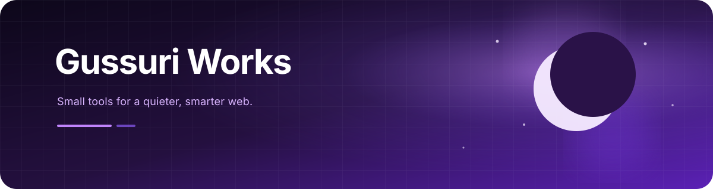

  

 

## Selected work

<table>
  <tr>
    <td valign="top">
      <h3>🛡️ Spoiler Guard for YouTube</h3>
      
A Chrome extension for avoiding spoilers on YouTube.

      
<strong>Core:</strong> LLM-assisted spoiler classification with shared blocklists and local filtering.

      
<a href="https://spoiler.gussuriworks.com/">Live</a> · <a href="https://chromewebstore.google.com/detail/filikhhcifickcnnihlahniajlhbokbl">Install</a> · <a href="https://github.com/gussuri/spoiler-guard-extension/releases/latest">Releases</a> · <a href="https://github.com/gussuri/spoiler-guard-extension">Repository</a>

    </td>
    <td valign="top">
      <h3>📡 Codex Reset Observatory</h3>
      
Codex reset history and next-reset estimates in one place.

      
<strong>Core:</strong> Automatically collects posts from X, reads reset signals with rules and LLMs, and updates the site.

      
<a href="https://codex.gussuriworks.com/">Live</a> · <a href="https://github.com/gussuri/codex-reset-observatory">Repository</a>

    </td>
  </tr>
</table>

## Currently exploring

  <code>TypeScript</code> ·
  <code>Next.js</code> ·
  <code>Chrome Extensions</code> ·
  <code>LLM Integration</code> ·
  <code>Observability</code>

